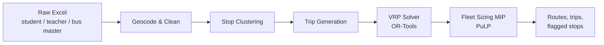

# School Bus Route Optimization

An end-to-end optimization system that turns raw school transport records into
cost-efficient bus routes — geocoding messy addresses, clustering students into
walkable bus stops, solving a constrained Vehicle Routing Problem with Google
OR-Tools, and sizing the fleet with an integer program.

Built for a real multi-branch school operating a mixed-capacity bus fleet across
morning pickup and afternoon drop schedules.

---

## The Problem

A school transport team receives a spreadsheet of student and teacher addresses
and has to answer three coupled questions:

1. **Where should buses stop?** Every student should walk no more than a few
   hundred metres, but every extra stop adds dwell time to the trip.
2. **What route should each bus take?** Buses must reach school within the
   arrival window, and no child should sit on the bus longer than the policy
   allows for their distance from school.
3. **How many buses of each type are actually needed?** Larger buses cost more
   but carry more; monthly kilometre caps limit how hard each bus can be worked.

Solving these by hand produces routes that are legal but expensive. This project
solves them as an optimization pipeline.

---

## Pipeline



| Stage | Module | What it does |
|---|---|---|
| **Geocode & Clean** | [scripts/geocode_and_clean.py](scripts/geocode_and_clean.py) | Normalizes column names, detects address-like columns by keyword, geocodes via Google Maps with a Nominatim fallback, caches every lookup to disk, and validates each coordinate against its school's centre — flagging `geocode_failed` and `out_of_radius` rows into an issues CSV instead of silently poisoning the solver. |
| **Stop Clustering** | [src/clustering/clusterer.py](src/clustering/clusterer.py) | Runs DBSCAN over participant coordinates with `eps` set from the maximum walk distance, producing pickup and drop stops plus a participant→stop mapping. Dwell time per stop is looked up from a boarding-time band table (more students → longer wait). |
| **Trip Generation** | [src/tripgen/trip_generator.py](src/tripgen/trip_generator.py) | Greedy nearest-stop trip construction plus a first-pass fleet packing — a fast baseline and a warm start for the exact solver. |
| **VRP Solver** | [src/tripgen/vrp_optimizer.py](src/tripgen/vrp_optimizer.py) | The core. An OR-Tools capacitated VRP with time windows, solved per (school branch, batch). |
| **Fleet Sizing** | [src/optimization/fleet_optimizer.py](src/optimization/fleet_optimizer.py) | A PuLP integer program that assigns trips to bus types and minimizes total fixed fleet cost subject to capacity, availability, and monthly-kilometre limits. |
| **Distance & Time** | [src/routing/route_fetcher.py](src/routing/route_fetcher.py) | Real driving distances and durations from the Google Directions API, with a persistent cache and a haversine fallback so the pipeline runs offline and without burning API quota. |

---

## Constraints Modelled

The solver treats these as hard constraints rather than post-hoc checks:

- **Arrival time windows** — students must arrive within `[school_start − 30 min, school_start + 15 min]`, with a separate calendar for exam days.
- **Distance-aware ride time** — maximum time on the bus is looked up per student from a distance→allowed-time table, so a child living 3 km away is not routed on a 60-minute loop.
- **Vehicle capacity** — usable seats per bus derived from seating capacity, declared empty seats, and a maximum occupancy factor.
- **Walk distance** — no student assigned to a stop further than `max_walk_meters` away.
- **Dwell time** — per-stop boarding time scaled by the number of students at that stop.
- **Fleet utilisation** — per-bus daily and monthly kilometre caps, daily driving-time caps, and a reserve-bus allowance.

Stops that cannot satisfy the ride-time policy under any feasible route are not
dropped — they are written out as **flagged/impossible stops** for the transport
team to review.

---

## Tech Stack

**Optimization** — Google OR-Tools (constraint-programming VRP), PuLP (MIP fleet sizing)
**Data & ML** — pandas, NumPy, scikit-learn (DBSCAN)
**Geospatial** — Google Maps Platform (Geocoding + Directions), geopy / Nominatim, Folium
**Application** — Streamlit dashboard, structlog JSON logging, YAML-driven configuration
**Runtime** — Python 3.11+

---

## Getting Started

### Install

```bash
git clone https://github.com/Pramod0210/ROUTE_OPTIMIZATION.git
cd ROUTE_OPTIMIZATION

python -m venv myvenv && source myvenv/bin/activate
pip install -r requirements.txt
```

### Configure

Set your Google Maps key (optional — the pipeline falls back to Nominatim
geocoding and haversine distances without it):

```bash
echo "GOOGLE_MAPS_API_KEY=your_key_here" > .env
```

All tunable parameters live in [config/config.yaml](config/config.yaml) — no
constants are hard-coded in the solver:

```yaml
constraints:
  max_bus_km_per_month: 9000
  max_occupancy: 0.9
  max_student_ride_time: 60   # minutes
  max_walk_meters: 300

routing:
  avg_speed_kmph: 50
  use_google_directions: true
  school_days_per_month: 22
```

### Input Data

Place the source workbooks under `data/raw/` (git-ignored). The pipeline expects
a school master file plus student, teacher, bus, and parking records; column
names are normalized automatically and address columns are detected by keyword.

### Run

```bash
# 1. Geocode and clean the raw workbooks
python -m scripts.geocode_and_clean

# 2. Cluster participants into pickup / drop stops
python -m src.clustering.clusterer

# 3. Launch the dashboard to solve and inspect routes
streamlit run streamlit_app.py
```

The Streamlit app lets you pick a branch/batch (or run all), override the
vehicle cap and solver time limit, watch solver progress live, and download the
results.

---

## Outputs

Each run writes a timestamped job directory containing:

| File | Contents |
|---|---|
| `routes_<branch>_<batch>.csv` | Ordered stop sequence per bus, with distance and timing |
| `trip_records_<branch>_<batch>.csv` | Per-trip summary: kilometres, duration, students carried |
| `impossible_<branch>_<batch>.csv` | Stops violating the ride-time policy, flagged for review |

Structured JSON logs for every run land in `logs/`.

---

## Project Structure

```
ROUTE_OPTIMIZATION/
├── config/config.yaml          # All constraints, paths, and solver parameters
├── scripts/
│   └── geocode_and_clean.py    # Stage 1 — geocoding, validation, caching
├── src/
│   ├── clustering/clusterer.py     # Stage 2 — DBSCAN stop generation
│   ├── tripgen/
│   │   ├── trip_generator.py       # Stage 3 — greedy trips + fleet packing
│   │   └── vrp_optimizer.py        # Stage 4 — OR-Tools VRP with time windows
│   ├── optimization/
│   │   └── fleet_optimizer.py      # Stage 5 — PuLP fleet-sizing MIP
│   └── routing/route_fetcher.py    # Cached Google Directions / haversine
├── utils/                      # Config loading, caching, haversine, helpers
├── logger/                     # structlog JSON logger
├── exception/                  # Custom exception wrapper
├── notebooks/                  # Routing experiments
└── streamlit_app.py            # Dashboard
```

---

## Design Notes

A few decisions worth calling out:

- **Every external call is cached.** Geocoding and routing results are persisted
  to CSV keyed by rounded coordinates, so re-running the pipeline over the same
  addresses costs nothing and works offline.
- **Graceful degradation over hard failure.** Missing Google credentials fall
  back to Nominatim and haversine distances; missing optional tables fall back to
  configured defaults. The pipeline always produces a result plus an explicit
  list of what it could not resolve.
- **Solve per branch/batch, not globally.** Buses do not cross branches in
  practice, so partitioning the VRP keeps each subproblem tractable while
  preserving solution quality.
- **Two-layer optimization.** The VRP decides *routes*; the MIP decides *which
  buses run them*. Separating the two keeps both problems solvable at real-world
  scale.

---

## Privacy

This repository contains no student data. All raw and processed data
directories, geocode caches, logs, and results are excluded via `.gitignore`.

---

## Author

**Pramod** — [github.com/Pramod0210](https://github.com/Pramod0210)
